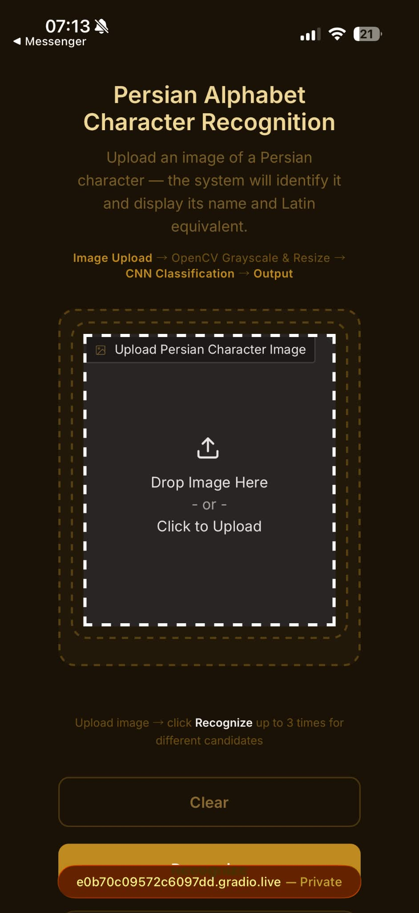
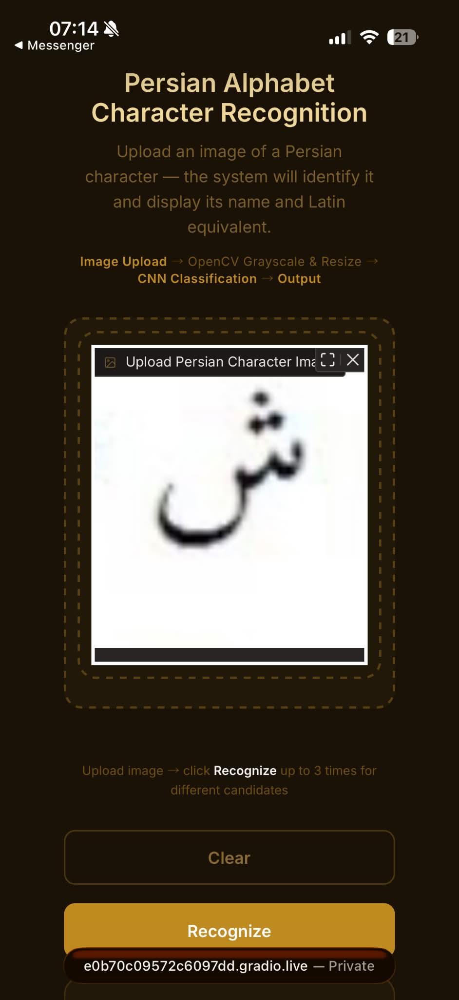
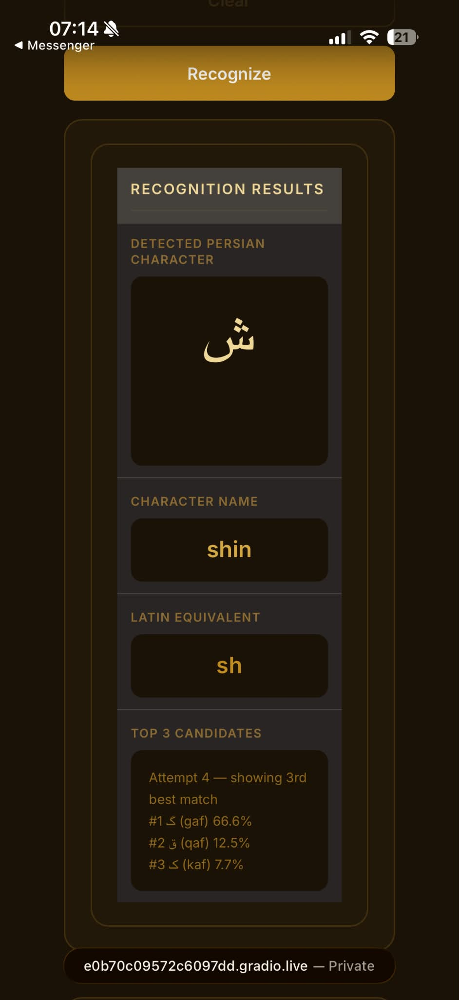
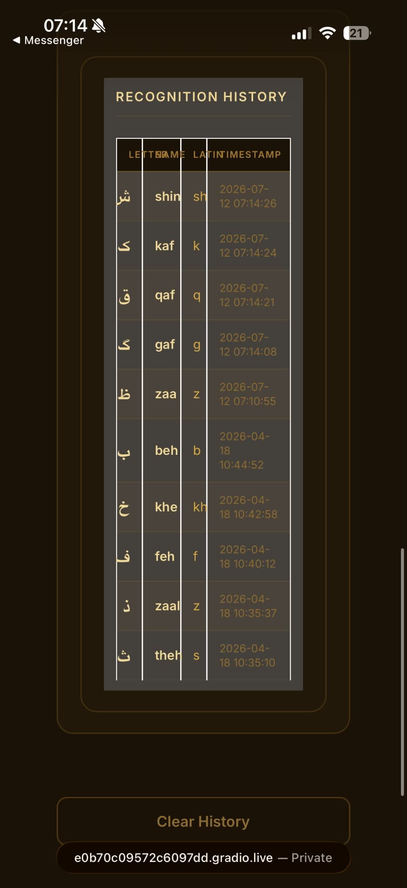

# Persian OCR

A deep learning-based Optical Character Recognition (OCR) system that recognizes Persian alphabet characters from images using a custom Convolutional Neural Network (CNN). The application predicts the corresponding Persian character and displays its Latin equivalent through an interactive Gradio interface.

## Tech Stack

| Category | Tool |
| --- | --- |
| Model | Custom CNN (PyTorch) |
| Image Processing | OpenCV |
| User Interface | Gradio |
| Database | SQLite |
| Programming Language | Python 3.11 |

## Setup

Clone the repository:

```bash
git clone https://github.com/mxrooby/persian-ocr.git
cd persian-ocr
```

Create and activate a virtual environment.

### Windows

```powershell
python -m venv venv
venv\Scripts\activate
```

### macOS / Linux

```bash
python3 -m venv venv
source venv/bin/activate
```

Install the required dependencies.

```bash
python -m pip install --upgrade pip
pip install -r requirements.txt
```

## Train the Model

Run:

```bash
python train.py
```

This will:

- Train the CNN model using the training dataset.
- Automatically save the best-performing model to:
  - `model/persian_cnn.pth`
  - `model/label_map.json`

> **Note:** The trained model (`persian_cnn.pth`) is not included in this repository because model files (`*.pth`) are excluded through `.gitignore`. Run `train.py` before using `test.py` or `app.py`.

## Evaluate the Model

Run:

```bash
python test.py
```

This will:

- Load the trained model.
- Evaluate the model using the test dataset.
- Display:
  - Overall Accuracy
  - Accuracy per Persian character
  - Performance summary

## Run the Application

Run:

```bash
python app.py
```

After launching the application, open the URL displayed in the terminal to access the Gradio interface.

## How to Use

1. Upload an image of a Persian alphabet character.
2. Click **Recognize**.
3. The application displays:
   - Predicted Persian character
   - Character name
   - Latin equivalent
4. If the prediction is incorrect, click **Recognize** again to retry using the next best prediction (up to three attempts).
5. View previous predictions in the **History** section.

## Preview

| Main Interface | Upload Image |
| --- | --- |
|  |  |

| Recognition Result | Prediction History |
| --- | --- |
|  |  |

## Project Structure

```text
persian-ocr/
├── app.py
├── train.py
├── test.py
├── preprocessing.py
├── database.py
├── requirements.txt
├── README.md
├── dataset/
│   ├── train/
│   ├── test/
│   └── label_map.json
├── model/
│   └── label_map.json
├── screenshots/
│   ├── main.png
│   ├── upload.png
│   ├── result.png
│   └── history.png
└── static/
```

## Notes

- Ensure the dataset is properly structured before training.
- The best-performing model is automatically saved during training based on validation accuracy.
- Since `*.pth` files are excluded through `.gitignore`, the trained model must be generated by running `python train.py`.
- This project was developed and tested using **Python 3.11**.

## Troubleshooting

### Model Not Found

If you encounter:

```text
ERROR: Model not found. Run python train.py first.
```

Generate the trained model by running:

```bash
python train.py
```

### NumPy Compatibility (macOS)

If you encounter:

```text
RuntimeError: Numpy is not available
```

or

```text
A module that was compiled using NumPy 1.x cannot be run in NumPy 2.x
```

Install the compatible NumPy version:

```bash
pip install numpy==1.26.4
```

### OpenCV Warnings (Windows)

Some Windows environments may display OpenCV warnings when reading image files with Unicode (Persian) filenames. If training continues normally, these warnings can generally be ignored.
